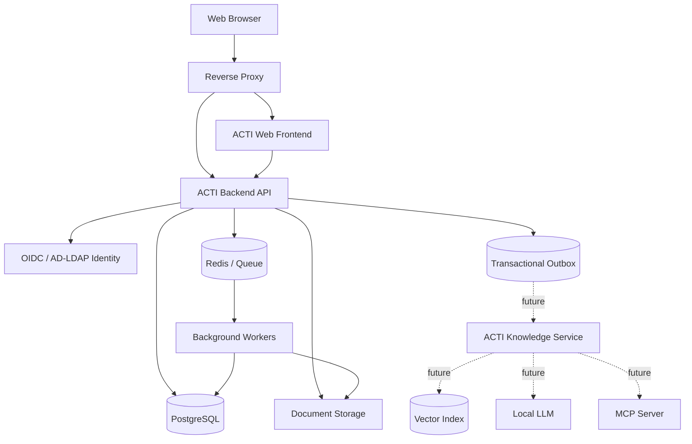
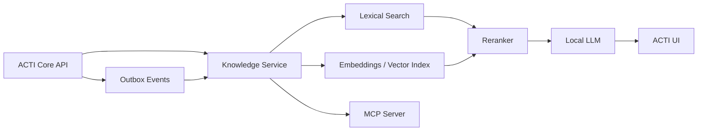

# ACTI v3 — целевая концепция и дорожная карта

> Статус документа: архитектурное видение продукта и план развития.  
> Это не коммерческое предложение и не закупочное техническое задание.

## 1. Назначение ACTI v3

ACTI v3 должна стать единой системой организационных знаний и процессов администрации.

Цель системы — не только хранить документы, а связывать в одной модели:

- муниципальные нормативные и организационно-распорядительные документы;
- версии и правовой статус документов;
- связи между документами;
- структурированные метаданные;
- подразделения, роли и ответственных;
- процессы и последовательности действий;
- шаблоны и примеры предыдущей практики;
- полнотекстовое содержание документов;
- историю изменений и действий пользователей;
- в перспективе — локальный интеллектуальный слой, RAG и MCP.

ACTI не должна позиционироваться как замена КонсультантПлюс. КонсультантПлюс отвечает на вопрос о федеральном и региональном праве, а ACTI должна отвечать на вопрос:

> **Как устроена работа именно нашей администрации, какими внутренними и муниципальными документами она регулируется, кто отвечает за каждый шаг, что необходимо сделать и что делалось раньше в аналогичных случаях?**

Главный продукт ACTI — не чат, а формализованная организационная память.

---

## 2. Уровни знаний в системе

ACTI должна разделять источники по смыслу и достоверности.

### Уровень 1. Внешняя нормативная база

Федеральные и региональные нормы.

На первом этапе ACTI не должна пытаться копировать полноценную правовую справочную систему. Достаточно иметь возможность:

- хранить ссылки и реквизиты внешних нормативных актов;
- связывать их с муниципальными документами и процессами;
- в будущем подключать внешние правовые источники через допустимые интеграции.

### Уровень 2. Муниципальное регулирование

- постановления;
- распоряжения;
- решения;
- положения;
- порядки;
- регламенты;
- иные муниципальные акты.

### Уровень 3. Организационные знания

- инструкции;
- локальные порядки;
- методические материалы;
- служебные документы;
- шаблоны;
- памятки;
- внутренние разъяснения.

### Уровень 4. Процессы

Формализованное описание того, **как выполняется работа**:

- последовательность шагов;
- ветвления;
- сроки;
- входные данные;
- результаты;
- ответственные роли;
- используемые системы;
- нормативные основания;
- шаблоны;
- связанные документы.

### Уровень 5. Практика

- аналогичные ранее выполненные действия;
- предыдущие документы;
- типовые решения;
- результаты;
- примеры корректного оформления.

---

## 3. Основные архитектурные принципы

1. **PostgreSQL — единый источник истины для структурированных данных.**
2. **Файлы документов хранятся отдельно от БД**, через абстракцию хранилища.
3. **Frontend никогда не обращается к PostgreSQL или файловому хранилищу напрямую.**
4. Все операции выполняются через версионированный Backend API.
5. Система должна работать полноценно **без LLM**.
6. Формы и дополнительные поля должны расширяться администраторами без изменения кода.
7. Документы, формы, процессы и связи должны быть версионируемыми.
8. Права доступа применяются **до поиска, экспорта и передачи данных интеллектуальным сервисам**.
9. Полнотекстовый поиск является базовой функцией, а семантический поиск — будущим дополнительным слоем.
10. Интеграции должны строиться через API и события, а не через прямой доступ к БД.
11. Система ориентируется на локальное/on-premises развёртывание без обязательной зависимости от внешних облаков.
12. Любая автоматическая классификация или будущий вывод LLM является предложением, но не заменяет официальные метаданные и подтверждённые связи.

---

## 4. Целевая архитектура



### Базовый технологический стек

Рекомендуемый исходный стек:

- **Frontend:** React + TypeScript;
- **Backend:** Python + FastAPI;
- **ORM / migrations:** SQLAlchemy + Alembic;
- **Database:** PostgreSQL 16+;
- **Text search:** PostgreSQL Full Text Search + GIN + `pg_trgm`;
- **Queue/cache:** Redis;
- **Background processing:** Dramatiq, Celery или эквивалент;
- **Reverse proxy:** Nginx;
- **Identity:** OIDC; при необходимости Keycloak/аналог с интеграцией AD/LDAP;
- **Deployment:** Docker Compose / Podman Compose на первом этапе;
- **Storage:** локальная файловая система через интерфейс StorageProvider, с возможностью перехода на S3/MinIO.

Точный набор библиотек допускается менять без изменения принципов архитектуры.

---

## 5. Хранение документов

PostgreSQL хранит карточку, метаданные, связи и историю. Бинарные оригиналы документов хранятся в отдельном документном хранилище.

### Базовые сущности

```text
Document
 ├─ DocumentVersion
 │   ├─ DocumentFile
 │   ├─ ContentExtraction
 │   └─ DocumentBlock
 ├─ DocumentRelation
 ├─ DocumentAccess
 ├─ Signers / Approvers / Executors
 └─ AuditEvents
```

### Document

Стабильная логическая карточка документа.

Минимальное ядро:

- UUID/ID;
- тип документа;
- регистрационный номер;
- регистрационная дата;
- заголовок;
- статус;
- текущая версия;
- уровень доступа;
- дата создания;
- дата изменения.

### DocumentVersion

Каждое содержательное изменение файла создаёт отдельную версию.

Хранить:

- номер версии;
- документ;
- файл;
- автора версии;
- дату;
- причину изменения;
- признак текущей версии;
- состояние публикации/утверждения при необходимости.

Старые версии не перезаписываются.

### DocumentFile

Хранить:

- storage key;
- исходное имя файла;
- MIME type;
- размер;
- SHA-256;
- дату загрузки;
- пользователя;
- технический статус.

Frontend не должен получать реальные серверные пути.

### StorageProvider

Backend должен работать через единый интерфейс:

```text
put()
get()
open_stream()
exists()
stat()
delete_if_allowed()
```

Первая реализация — LocalFileStorage. В дальнейшем без изменения бизнес-логики должна подключаться S3-compatible реализация.

---

## 6. Конструктор типов документов и форм

Это одна из ключевых функций ACTI v3.

Администратор должен иметь возможность создать новый тип документа или расширить существующий **без изменения исходного кода и без ручной модификации схемы PostgreSQL**.

### Стабильное ядро + динамические данные

Основные реквизиты документа хранятся типизированными колонками.

Дополнительные поля конкретного типа документа хранятся в `JSONB`, но управляются зарегистрированной схемой формы.

Пример:

```text
documents
    id
    document_type_id
    reg_number
    reg_date
    title
    status_id
    current_version_id
    custom_data JSONB
```

### Сущности конструктора

- DocumentType;
- DocumentTypeVersion;
- FormSchema;
- FormSection;
- FieldDefinition;
- ReferenceSet;
- ReferenceItem.

### Поддерживаемые типы полей

Минимально:

- короткий текст;
- длинный текст;
- целое число;
- десятичное число;
- дата;
- дата и время;
- логическое значение;
- одиночный справочник;
- множественный справочник;
- пользователь;
- подразделение;
- ссылка на другой документ;
- файл/вложение;
- повторяемая группа полей.

### Для каждого поля настраивается

- системный ключ;
- отображаемое название;
- описание/подсказка;
- тип;
- обязательность;
- значение по умолчанию;
- допустимый диапазон;
- регулярное выражение или декларативная валидация;
- справочник;
- порядок отображения;
- раздел формы;
- доступность для редактирования;
- условия отображения;
- условия обязательности;
- участие в фильтрах;
- участие в полнотекстовом поиске;
- участие в экспорте;
- видимость для ролей.

Условия должны описываться декларативно, например ограниченным JSON Logic-подобным синтаксисом. В административном конструкторе нельзя разрешать произвольное выполнение Python/JavaScript-кода.

### Версионирование схем

Изменение формы создаёт новую версию схемы.

Старые значения:

- не должны теряться;
- остаются читаемыми;
- могут быть мигрированы отдельной управляемой операцией;
- должны иметь информацию о том, по какой версии схемы они создавались.

---

## 7. Справочники

Администратор должен самостоятельно создавать и сопровождать справочники:

- подразделения;
- категории;
- виды объектов;
- территории;
- источники публикации;
- статусы;
- любые предметные классификаторы.

Справочник поддерживает:

- код;
- название;
- описание;
- активность;
- даты действия;
- порядок сортировки;
- иерархию при необходимости;
- импорт/экспорт;
- историю изменений.

Нельзя проектировать новые справочники только как новые таблицы, требующие участия разработчика.

---

## 8. Поиск

ACTI должна иметь полноценный поиск независимо от LLM.

### Метаданный поиск

Фильтрация по:

- типу;
- номеру;
- дате;
- статусу;
- исполнителю;
- подразделению;
- подписанту;
- пользовательским полям;
- диапазонам дат;
- справочникам;
- связям.

### Полнотекстовый поиск

Индексируются:

- заголовки;
- текстовые метаданные;
- извлечённое содержание файлов;
- разрешённые пользовательские поля.

Использовать:

- PostgreSQL `tsvector`;
- GIN;
- `pg_trgm` для опечаток и неточного строкового поиска.

Выдача должна содержать:

- карточку документа;
- релевантный фрагмент;
- совпавшие поля;
- версию источника;
- возможность открыть оригинал.

### Что не требуется в ядре

В базовом ACTI v3 не обязательны:

- embeddings;
- vector database;
- semantic search;
- reranker;
- генеративный ответ.

Они добавляются отдельным knowledge-слоем.

---

## 9. Извлечение содержания документов

Фоновый worker должен извлекать текст из цифровых документов один раз и сохранять нормализованное представление.

### ContentExtraction

Хранить:

- document_version_id;
- parser_name;
- parser_version;
- source_sha256;
- extracted_at;
- status;
- full_text;
- warnings/errors.

### DocumentBlock

Вместо привязки будущего RAG к произвольным чанкам основное ядро должно хранить устойчивые структурные блоки документа:

- заголовок;
- абзац;
- пункт;
- таблица;
- строка таблицы;
- приложение;
- иной блок.

Для блока:

- стабильный ID;
- порядок;
- текст;
- тип;
- номер страницы при доступности;
- координата/позиция в источнике;
- parent block;
- версия документа.

Будущий RAG сможет формировать собственные chunks из этих блоков, не меняя основную модель ACTI.

OCR рассматривается отдельным расширением для документов без цифрового текстового слоя.

---

## 10. Граф связей документов

ACTI должна уметь описывать не только сами документы, но и отношения между ними.

### Типы связей

Минимально:

- изменяет;
- изменён;
- отменяет;
- утратил силу на основании;
- заменяет;
- утверждает;
- является приложением к;
- ссылается на;
- принят во исполнение;
- связан по предмету;
- предыдущая/следующая редакция.

### DocumentRelation

Хранить:

- source document/version;
- target document/version;
- relation type;
- при необходимости source block;
- описание;
- источник связи;
- статус подтверждения;
- автора подтверждения;
- дату.

Источник связи:

- manual;
- deterministic rule;
- imported;
- AI suggested.

Автоматически предложенная связь не должна становиться юридически значимой без подтверждения, если она влияет на официальный статус документа.

### Пользовательский результат

Карточка должна показывать:

- что изменяет документ;
- чем он изменён;
- что отменено;
- на какие акты ссылается;
- связанные приложения;
- историю редакций;
- цепочку связанных документов.

---

## 11. Процессный слой

ACTI должна описывать **не только нормативную основу, но и фактическую организационную последовательность работы**.

Это принципиально отличает ACTI от обычной правовой справочной системы.

### Базовые сущности

```text
Process
 └─ ProcessVersion
     ├─ ProcessStep
     │   ├─ StepSource
     │   ├─ StepTemplate
     │   ├─ InputRequirement
     │   └─ OutputRequirement
     └─ ProcessTransition
```

### Process

Содержит:

- название;
- назначение;
- владелец процесса;
- ответственное подразделение;
- статус;
- категорию;
- актуальную версию.

### ProcessVersion

Процесс должен быть версионируемым по датам действия.

Нужно иметь возможность ответить:

> Как процесс выполняется сейчас?

и при необходимости:

> Как он выполнялся на определённую дату?

### ProcessStep

Для каждого шага хранить:

- название;
- подробную инструкцию;
- ответственную роль;
- подразделение;
- ориентировочную длительность;
- нормативный/организационный срок;
- необходимые входные данные;
- результат шага;
- используемую информационную систему;
- контрольные условия;
- связанные шаблоны;
- допустимые следующие шаги.

### ProcessTransition

Поддержать ветвления:

```text
Если условие A -> шаг 5
Если условие B -> шаг 7
Иначе -> шаг 6
```

Условия должны быть декларативными.

### Связь шага с основанием

Каждый значимый шаг может быть связан с:

- документом;
- конкретной версией документа;
- конкретным фрагментом;
- инструкцией;
- шаблоном;
- внешним нормативным источником.

В интерфейсе должна существовать функция по смыслу:

> **Почему этот шаг существует?**

Она показывает основание, актуальную версию и связанные документы.

### Первая стадия процессного слоя

Сначала ACTI хранит **описание процесса** и является Process Knowledge System.

Не требуется сразу строить сложный BPM-движок.

### Вторая стадия

После стабилизации процессных моделей можно добавить:

- ProcessInstance;
- текущий шаг;
- checklist;
- историю прохождения;
- исполнителя;
- сроки;
- прикреплённые результаты;
- простые задачи.

То есть ACTI сможет отвечать не только:

> Что нужно делать?

но и:

> Где мы сейчас по конкретной закупке?

Полноценный workflow/BPM с автоматическим согласованием является отдельным этапом развития.

---

## 12. Пример: процесс закупки

ACTI должна уметь представить процесс в форме:

```text
Проведение закупки
  1. Возникновение потребности
  2. Проверка финансирования
  3. Формирование требований
  4. Определение способа закупки
     ├─ условие A -> маршрут A
     └─ условие B -> маршрут B
  5. Подготовка документов
  6. Согласование
  7. Проведение процедуры
  8. Заключение контракта
  9. Приёмка
 10. Оплата
 11. Архивирование
```

Для каждого шага пользователь должен видеть:

- что сделать;
- кто отвечает;
- срок;
- основание;
- шаблон;
- вход;
- ожидаемый результат;
- похожие ранее выполненные случаи;
- следующий допустимый шаг.

Таким образом пользователь не получает текстовую консультацию, а получает подтверждённый маршрут работы.

---

## 13. Пользователи, роли и права

### Основные сущности

- User;
- Department;
- Role;
- Group;
- Permission;
- DocumentACL;
- ProcessACL;
- ServiceAccount.

### Идентификация

Целевой вариант — OIDC.

Для локальной инфраструктуры допускается Identity Provider, подключённый к Active Directory/LDAP.

### Модель доступа

Система должна сочетать:

- роли;
- подразделения;
- уровень доступа;
- права на тип документа;
- индивидуальные ACL при необходимости.

Проверка доступа выполняется backend-ом для:

- карточки;
- файла;
- версии;
- результатов поиска;
- экспорта;
- API;
- будущего RAG/MCP.

Факт наличия документа в поисковом индексе никогда не должен позволять пользователю узнать о документе, к которому он не имеет доступа.

---

## 14. Аудит и история

Аудит является базовым системным сервисом.

Фиксировать минимум:

- создание карточки;
- изменение метаданных;
- изменение пользовательских полей;
- загрузку новой версии;
- просмотр/скачивание чувствительных файлов при выбранной политике;
- изменение прав;
- изменение схемы формы;
- изменение справочника;
- изменение процесса;
- подтверждение/отклонение связи;
- системные импортные операции.

Audit Event должен содержать:

- время;
- пользователь/service account;
- действие;
- объект;
- old/new snapshot или diff;
- correlation ID;
- источник запроса.

---

## 15. API как контракт системы

Все функции frontend должны использовать тот же API, который в дальнейшем смогут использовать внешние системы и интеллектуальные сервисы.

Базовые группы:

```text
/api/v1/documents
/api/v1/document-types
/api/v1/files
/api/v1/references
/api/v1/search
/api/v1/relations
/api/v1/processes
/api/v1/users
/api/v1/audit
```

API должен:

- использовать OpenAPI;
- быть версионированным;
- поддерживать pagination;
- иметь единый формат ошибок;
- использовать correlation/request ID;
- возвращать стабильные идентификаторы документов, версий и блоков.

Прямой SQL-доступ внешним потребителям не является интеграционным интерфейсом.

---

## 16. Событийная готовность

Не требуется внедрять Kafka/RabbitMQ только ради архитектуры.

На первом этапе использовать **Transactional Outbox** в PostgreSQL.

Примеры событий:

```text
document.created
document.metadata.updated
document.version.created
document.content.extracted
document.access.changed
document.relation.changed
process.created
process.version.published
form.schema.published
```

Фоновый dispatcher доставляет их внутренним потребителям.

Позже outbox может публиковаться в отдельный брокер без изменения доменной логики.

---

## 17. Подготовка к LLM/RAG

ACTI v3 должна быть **готова к подключению интеллектуального слоя**, но полноценный RAG не является обязательной частью ядра.

### Ядро обязано предоставить

1. стабильный ID документа;
2. стабильный ID версии;
3. структурированное извлечённое содержание;
4. стабильные ID блоков;
5. метаданные и отношения;
6. процессную модель;
7. version-aware API;
8. проверку ACL;
9. события изменений;
10. service accounts;
11. возможность ссылаться на точный источник.

### Будущая архитектура



### Принципы будущего AI-слоя

- LLM не подключается напрямую к PostgreSQL;
- LLM не получает доступ к файловой системе;
- retrieval выполняется с учётом прав пользователя;
- ответ обязан ссылаться на документы и версии;
- по возможности ссылка должна вести на конкретный блок/фрагмент;
- сгенерированный текст не является официальным источником;
- AI-метаданные хранятся отдельно от подтверждённых;
- AI может предлагать связь, классификацию или поле, но публикация критичных изменений требует проверки;
- модель и embedding-модель должны заменяться независимо от ACTI Core.

### Что относится к отдельному проекту

- embeddings;
- vector search;
- reranker;
- полноценный RAG pipeline;
- локальная генеративная модель;
- evaluation framework;
- MCP server;
- AI-агенты;
- автоматическая подготовка проектов документов.

---

## 18. AI-метаданные и подтверждение человеком

Для будущих автоматически извлечённых данных предусмотреть отдельную сущность предложения:

```text
AISuggestion
    object_type
    object_id
    field/relation
    proposed_value
    confidence
    evidence_document_version
    evidence_block
    model
    model_version
    created_at
    status
    reviewed_by
    reviewed_at
```

Статусы:

- pending;
- accepted;
- rejected;
- superseded.

LLM не должна незаметно менять официальную карточку документа.

---

## 19. Web-интерфейс

Главный экран не должен строиться вокруг AI-чата.

Основные разделы:

- Моя работа;
- Документы;
- Процессы;
- Поиск;
- Шаблоны;
- Справочники;
- Администрирование;
- Аудит.

Будущий пункт **«Спросить ACTI»** является дополнительным интерфейсом к уже существующим данным и процессам.

### Карточка документа

Показывает:

- основные реквизиты;
- динамические поля;
- файл и версии;
- извлечённый текст;
- подписантов и исполнителей;
- связанные документы;
- процессы, использующие документ;
- историю;
- доступные действия.

### Карточка процесса

Показывает:

- схему шагов;
- текущую версию;
- ответственные роли;
- входы/выходы;
- условия перехода;
- основания;
- шаблоны;
- примеры;
- историю изменений.

---

## 20. Нефункциональные ориентиры

Исходные проектные ориентиры:

- 150 000+ карточек документов;
- возможность дальнейшего роста без смены архитектуры;
- 150+ пользователей;
- десятки одновременных пользовательских сессий;
- локальное размещение;
- поддержка современных Chromium-браузеров;
- корректная работа с Windows и Linux-клиентами через web;
- резервное копирование PostgreSQL и файлового хранилища;
- health endpoints;
- structured logging;
- метрики;
- контроль фоновых задач;
- воспроизводимое развёртывание.

Фактические целевые показатели производительности должны уточняться нагрузочными замерами на реальном объёме.

---

## 21. Измерение экономического и организационного эффекта

ACTI должна собирать обезличенные/допустимые эксплуатационные метрики, позволяющие доказать эффект внедрения.

### Базовые метрики

- число активных пользователей;
- количество поисков;
- среднее время до открытия релевантного документа;
- доля поиска по содержанию;
- использование шаблонов;
- использование процессных карточек;
- число переходов «документ -> связанный документ»;
- число обнаруженных ссылок на устаревшие документы;
- количество возвратов/исправлений при наличии данных;
- время прохождения типовых процессов;
- число обращений к ранее выполненным аналогам.

### До/после для пилотных процессов

Для 10–20 типовых процессов измерять:

- время поиска нормативной основы;
- время поиска предыдущего примера;
- время выяснения последовательности действий;
- число консультаций с коллегами;
- время подготовки результата;
- число возвратов;
- полный цикл процесса.

Экономический эквивалент может рассчитываться как:

```text
сумма(
    количество операций
    × экономия времени
    × стоимость рабочего часа
)
+ стоимость предотвращённой повторной работы
+ оценимые предотвращённые ошибки
```

Цель измерения — не сокращение штата, а рост производительности, уменьшение ошибок и снижение зависимости от неформального знания отдельных сотрудников.

---

## 22. Этапы разработки

### Этап 0. Предметная модель и аудит данных

Результат:

- утверждённая каноническая модель;
- перечень типов документов;
- перечень справочников;
- правила версионности;
- модель прав;
- модель процессов;
- инвентаризационный manifest документного корпуса;
- список аномалий данных;
- стратегия импорта.

Критерий выхода: понятно, какие данные являются источником истины и как они представлены в новой модели.

### Этап 1. Платформенное ядро

Реализовать:

- PostgreSQL;
- migrations;
- Backend API;
- web frontend shell;
- OIDC/идентификацию;
- роли;
- storage abstraction;
- LocalFileStorage;
- worker;
- Redis;
- audit infrastructure;
- outbox;
- базовый deployment.

Критерий выхода: пользователь может войти, а сервисы разворачиваются воспроизводимо.

### Этап 2. Реестр документов

Реализовать:

- Document;
- DocumentVersion;
- DocumentFile;
- загрузку;
- скачивание через backend;
- хеширование;
- версии;
- карточку документа;
- базовые справочники;
- ACL;
- историю.

Критерий выхода: ACTI является полноценным многопользовательским web-реестром документов.

### Этап 3. Конструктор документов

Реализовать:

- типы документов;
- версии типов;
- конструктор секций;
- все базовые типы полей;
- пользовательские справочники;
- декларативную валидацию;
- условия видимости;
- permissions;
- custom_data JSONB;
- фильтрацию и экспорт динамических полей.

Критерий выхода: новый тип документа и его форму можно создать без участия разработчика.

### Этап 4. Содержание и полнотекстовый поиск

Реализовать:

- extraction pipeline;
- ContentExtraction;
- DocumentBlock;
- full text index;
- pg_trgm;
- поиск по метаданным;
- поиск по тексту;
- snippets/highlighting;
- обработку ошибок extraction.

Критерий выхода: пользователь находит документ по его фактическому содержанию, а не только по карточке.

### Этап 5. Граф документов

Реализовать:

- DocumentRelation;
- типы связей;
- ручное создание;
- подтверждение;
- отображение графа/списка;
- переходы между связанными документами;
- историю правового/организационного статуса.

Критерий выхода: можно проследить цепочку «документ -> изменение -> отмена -> актуальная версия».

### Этап 6. Process Knowledge

Реализовать:

- Process;
- ProcessVersion;
- ProcessStep;
- ProcessTransition;
- входы/выходы;
- роли;
- сроки;
- условия;
- StepSource;
- шаблоны;
- связь с документами и блоками;
- визуальное отображение;
- функцию «Почему этот шаг существует?».

Критерий выхода: ключевой административный процесс можно пройти как проверенную последовательность действий с основаниями и шаблонами.

### Этап 7. Практика и организационная память

Добавить:

- связь процесса с аналогичными выполненными случаями;
- подбор предыдущих документов;
- типовые шаблоны;
- категории практики;
- ручное закрепление хорошего примера;
- метрики использования.

Критерий выхода: ACTI отвечает не только «что предписано», но и «как мы делали это раньше».

### Этап 8. Простой контроль выполнения процессов

После стабилизации Process Knowledge:

- ProcessInstance;
- current step;
- checklist;
- исполнители;
- сроки;
- результаты шагов;
- история прохождения.

Не строить сложный BPM до подтверждения потребности.

Критерий выхода: ACTI может показать состояние конкретного экземпляра процесса.

### Этап 9. Завершение LLM-ready контура

Проверить и стабилизировать:

- content/version API;
- block API;
- relation API;
- process API;
- service accounts;
- scoped tokens;
- ACL-aware retrieval;
- outbox events;
- ссылки на точный источник.

Для проверки использовать обычного тестового API-потребителя без LLM.

Критерий выхода: внешний knowledge-service может безопасно индексировать разрешённые данные без прямого подключения к БД.

### Этап 10. Отдельный AI/RAG проект

Отдельно проектируются:

- embedding model;
- chunking strategy;
- vector index;
- hybrid search;
- reranker;
- RAG;
- evaluation;
- local LLM;
- MCP;
- генерация и проверка проектов документов.

Этот этап не должен блокировать разработку и эксплуатацию ACTI Core.

---

## 23. Что не следует делать

### Не делать LLM центром архитектуры

Неправильно:

```text
Пользователь -> Chat -> LLM -> файлы
```

Правильно:

```text
Пользователь -> ACTI Core -> проверенные данные и процессы
                         -> optional Knowledge/LLM layer
```

### Не давать frontend прямой доступ к БД

Любые операции только через API.

### Не хранить бизнес-логику в формах frontend

Правила валидации, прав и переходов должны иметь серверное представление.

### Не использовать произвольный исполняемый код в конструкторе форм/процессов

Расширяемость должна оставаться контролируемой.

### Не считать AI-вывод официальным фактом

AI создаёт предложение с evidence, а не незаметно изменяет источник истины.

### Не строить сразу полноценный BPM

Сначала необходимо доказать ценность Process Knowledge.

### Не копировать функциональность КонсультантПлюс

Сильная сторона ACTI — внутренние муниципальные знания, процессы, практика и организационная память.

---

## 24. Критерий успеха ACTI v3

ACTI v3 можно считать сформированной как продукт, когда без LLM она позволяет сотруднику:

1. найти действующий документ по реквизитам или содержанию;
2. увидеть его актуальную версию и историю;
3. понять связи с другими документами;
4. открыть подтверждающее основание;
5. найти шаблон или аналогичный предыдущий случай;
6. открыть нужный административный процесс;
7. увидеть последовательность шагов;
8. понять, кто отвечает;
9. увидеть вход, результат и срок каждого шага;
10. ответить на вопрос «почему этот шаг требуется?» через конкретный источник;
11. создать новый тип документа или добавить поле без участия разработчика;
12. работать в рамках своих прав доступа;
13. получить все эти данные через документированный API.

После этого LLM, RAG и MCP становятся ускорителями уже существующей системы знаний, а не попыткой компенсировать отсутствие структурированной модели.

---

## 25. Целевая формула продукта

```text
ACTI
=
Document Registry
+ Versioned Document Storage
+ Dynamic Metadata Platform
+ Full-Text Search
+ Document Relationship Graph
+ Organizational Process Knowledge
+ Templates and Historical Practice
+ Access Control and Audit
+ Stable API and Events
+ Future Knowledge / RAG / MCP Layer
```

Ключевая идея:

> **ACTI должна знать не только “какие документы существуют”, но и “как администрация работает, почему она работает именно так и что было сделано раньше в похожей ситуации”.**

Именно эта модель должна быть фундаментом дальнейшего развития продукта.
